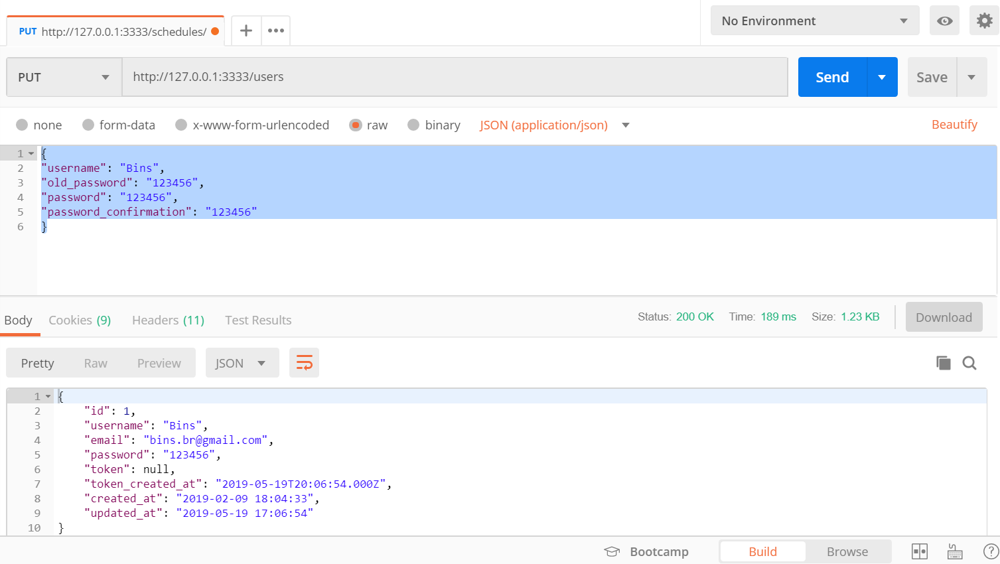
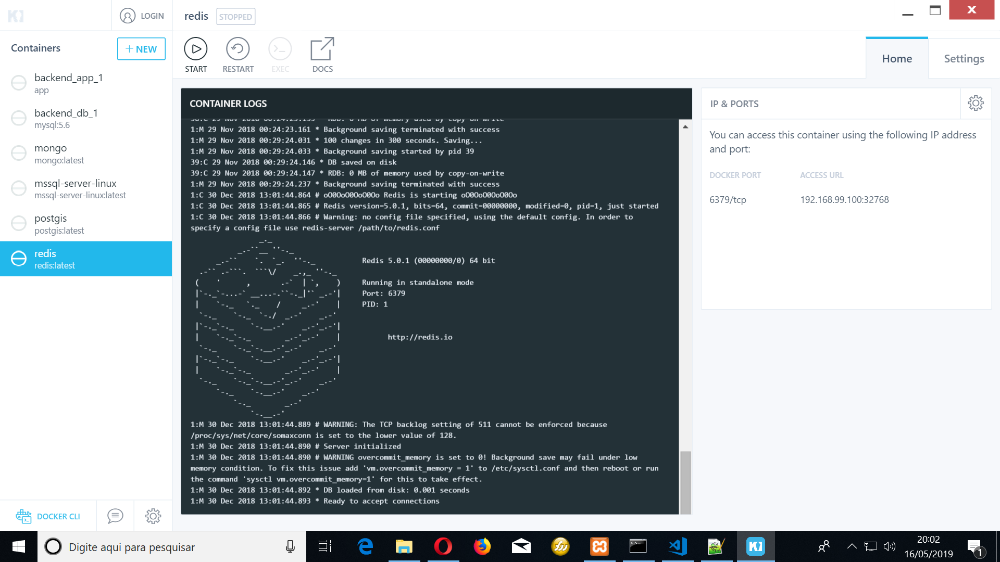
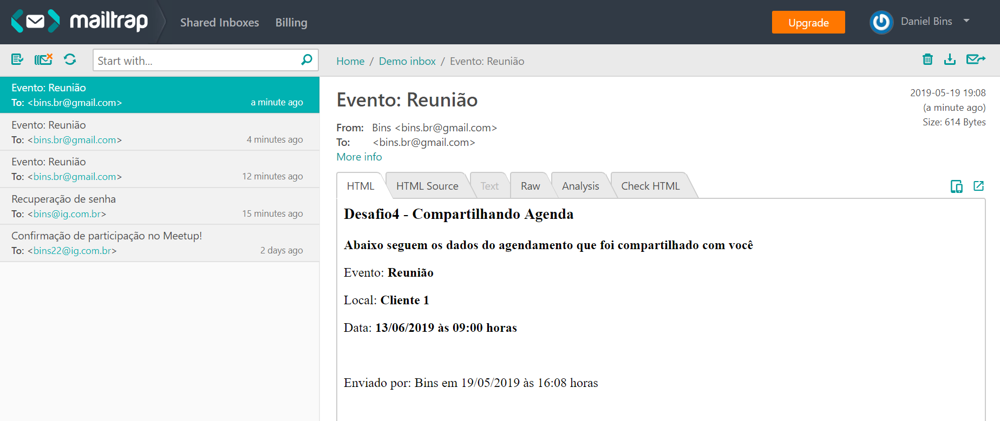

# Desafio 4

No desafio final você criará uma API REST com AdonisJS para um sistema de
agendamentos de compromissos (calendário). Deixe toda estrutura com ESLint,
EditorConfig, etc, que configuramos até agora pronta.



## Requisitos funcionais

- O usuário deve poder criar uma conta com nome, e-mail e senha;
- O usuário deve poder se autenticar na aplicação com e-mail e senha;
- O usuário deve poder alterar seu nome e senha informando a senha antiga, a senha nova e a confirmação da senha nova;
- O usuário deve poder cadastrar eventos em seu calendário com título, localização, data e horário;
- O usuário deve poder listar os eventos cadastrados por data;
- O usuário deve poder excluir um compromisso;
- O uário deve poder compartilhar um compromisso informando o e-mail do destinatário. Assim que compartilhado, o destinatário deve receber todas as informações do evento por e-mail;

## Requisitos não funcionais

- Utilize banco de dados SQL;
- Utilize fila com Redis para programar o envio de e-mails do compartilhamento de compromisso;

## Regras de negócio

- O e-mail do usuário é único;
- O usuário não pode alterar seu e-mail;
- Não deve ser possível cadastrar dois eventos no mesmo horário no calendário de um usuário;
- O usuário só pode ver/editar/deletar seus eventos;
- O usuário não pode editar/deletar um evento que já passou;
- Todos cadastros devem possuir validação de campos com mensagens legíveis;

## Instalação

- git clone https://github.com/dbins/rocketseat_nodejs_desafio4.git
- npm install
- Criar o banco de dados vazio no MySQL (nome: desafio4)
- Alterar as configurações de conexão com o banco de dados no arquivo .env localizado na raiz do projeto
- Rodar a migration: adonis migration:run
- Para ativar o servidor: adonis serve --dev
- O servidor vai subir no endereço http://127.0.0.1:3333. Isso pode ser alterado no arquivo .env localizado na raiz do servidor

## Redis

- No Windows 10, foi utilizado o Kitematic (Alpha) para gerenciar os containers
- Baixar o container Redis
- Iniciar o container Redis
- Editar o arquivo config/redis.js. No objeto local, colocar dados de conexão
- No arquivo .env localizado na raiz do projeto, configurar o REDIS_HOST
- No arquivo .env, localizado na raiz do projeto, colocar as credenciais de email MAIL_HOST - MAIL_PORT - MAIL_USER - MAIL_PASS
- Depois de iniciar o servidor, numa janela de terminal em separado, dentro da pasta do projeto, executar:
  adonis kue:listen

  
  

## Rotas da aplicação
### Rotas sem autenticação

| Rota      | Método | Descrição       |
| --------- | ------ | --------------- |
| /users    | POST   | Criar usuário   |
| /sessions | POST   | Gerar Token     |
| /recover  | POST   | Recuperar Senha |
| /reset    | PUT    | Alterar Senha   |

Request Criar Usuário
```
{
"username": "Bins",
"email": "bins.br@gmail.com",
"old_password": "123456",
"password": "123456",
"password_confirmation": "123456"
}
```

Request Gerar Token:
```
{
"email": "bins.br@gmail.com",
"password": "123456"
}
```

Request Recuperar Senha
```
{
"email": "bins@ig.com.br",
"redirect_url": "http://www.google.com.br"
}
```

Request Alterar Senha
```
{
"token": "bins222.br@gmail.com",
"password": "123456",
"password_confirmation": "123456",
"old_password": "123456"
}
```

### Rotas com autenticação
Para utilizar estas rotas é necessário enviar o bearer token no cabeçalho de cada requisição. Este token é gerado ao utilizar a rota /sessions

| Rota                 | Método | Descrição                |
| -------------------- | ------ | ------------------------ |
| /users               | PUT    | Alterar dados do usuário |
| /schedules           | GET    | Listar agenda do usuário |
| /schedules           | POST   | Criar uma nova agenda    |
| /schedules/:id       | GET    | Ver agenda selecionada   |
| /schedules/:id       | PUT    | Alterar agenda           |
| /schedules/:id       | DELETE | Apagar agenda            |
| /schedules/:id/share | POST   | Compartilhar agenda      |

Request Alterar Dados do Usuário
```
{
"username": "Bins",
"old_password": "123456",
"password": "123456",
"password_confirmation": "123456"
}
```

Request Criar Agenda
```
{
"title": "Reunião",
"local": "Cliente 1",
"date_event": "2019-02-13 08:00:00"
}
```

Request Alterar Agenda
```
{
"title": "Reunião atualizada",
"local": "Cliente 2",
"date_event": "2019-02-14 08:00:00"
}
```

Compartilhar Agenda
```
{
"emailShare": "bins.br@gmail.com"
}
```
